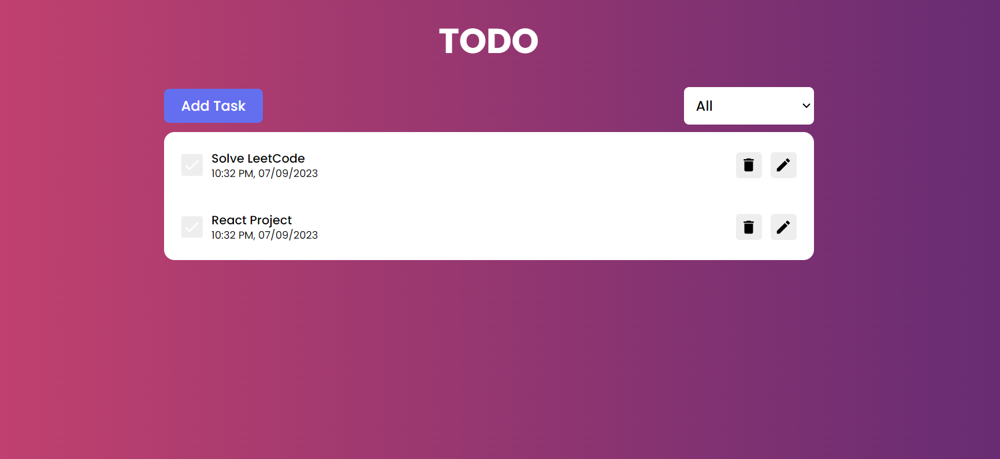

# React Todo App.

#### Demo: https://sshuklaji962.github.io/ToDo-App/

This is a simple React-based Todo application that implements CRUD (Create, Read, Update, Delete) operations with date and time tracking. The project utilizes various libraries and technologies for enhanced functionality and user experience.

## Features

1. **Todo CRUD Operations**: You can create, read, update, and delete tasks in the todo list.

2. **Date and Time**: Each todo item is timestamped with its creation date and time.

3. **Redux State Management**: Redux is used for efficient state management, ensuring seamless updates and interactions across the application.

4. **Framer Motion Animation**: Framer Motion is employed to add smooth animations to enhance the user interface and experience.

5. **React Hot Toast Notifications**: React Hot Toast is used for displaying notifications, providing real-time feedback to users for various actions or events within the app.

## Installation and Setup Instructions

1. Installation: `npm install`

2. In the project directory, you can run: `npm start`

Runs the app in the development mode.\
Open [http://localhost:3000](http://localhost:3000) to view it in the browser.
The page will reload if you make edits.
